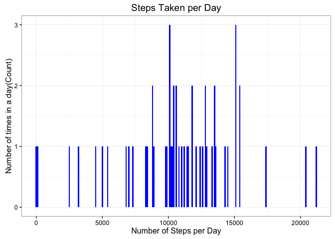
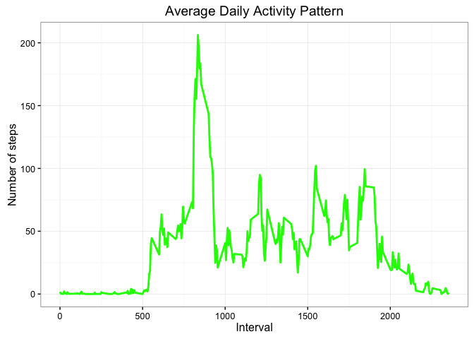
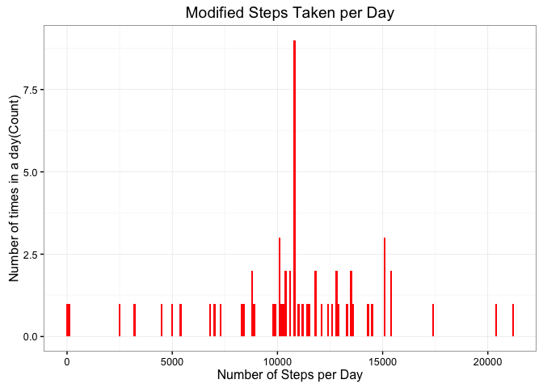
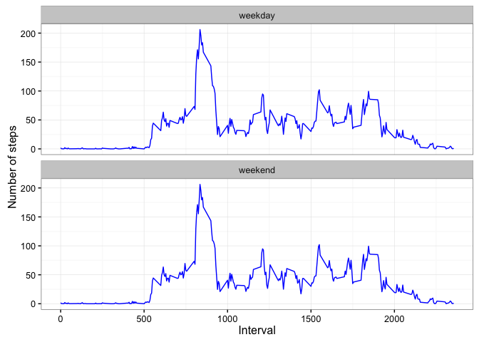

# Reproducible Research: Peer Assessment 1


## Loading and preprocessing the data


```r
act_data <- read.csv('activity.csv',  header = TRUE, sep = ",", colClasses=c("numeric", "character", "numeric"))

act_data$date <- as.Date(act_data$date, format = "%Y-%m-%d")
act_data$interval <- as.factor(act_data$interval)
```


## What is mean total number of steps taken per day?

```r
steps_per_day <- aggregate(steps ~ date, act_data, sum)
library(ggplot2)
```

```
## Warning: package 'ggplot2' was built under R version 3.2.4
```

```r
plt <-ggplot(steps_per_day, aes(x = steps)) 
plt <-plt + geom_histogram(fill = "blue", binwidth = 100) 
plt <- plt + labs(title="Steps Taken per Day", x = "Number of Steps per Day", y = "Number of times in a day(Count)") 
plt <-plt + theme_bw()
print(plt)
```



```r
steps_mean   <- mean(steps_per_day$steps, na.rm=TRUE)
steps_median <- median(steps_per_day$steps, na.rm=TRUE)
```

## What is the average daily activity pattern?

```r
steps_per_interval <- aggregate(act_data$steps,by = list(interval = act_data$interval),FUN=mean, na.rm=TRUE) 
steps_per_interval$interval <-as.integer(levels(steps_per_interval$interval)[steps_per_interval$interval]) 
colnames(steps_per_interval) <- c("interval", "steps")

plt2 <-ggplot(steps_per_interval, aes(x=interval, y=steps))
plt2 <-plt2 +  geom_line(color="green", size=1) 
plt2 <-plt2  +labs(title="Average Daily Activity Pattern", x="Interval", y="Number of steps")
plt2 <-plt2 + theme_bw()
print(plt2)
```




```r
max_interval <- steps_per_interval[which.max(steps_per_interval$steps),]
```


## Imputing missing values

```r
total_missing_vals <- sum(is.na(act_data$steps))
```
#Devise a strategy for filling in all of the missing values in the dataset. The strategy does not need to be sophisticated. For example, you could use the mean/median for that day, or the mean for that 5-minute interval, etc.


```r
na_index <- which(is.na(act_data$steps)) 
 
na_to_replace <- unlist(lapply(na_index, FUN=function(idx){  
        interval = act_data[idx,]$interval
        steps_per_interval[steps_per_interval$interval == interval,]$steps  }))

steps_to_fill <- act_data$steps 
steps_to_fill[na_index] <- na_to_replace


act_data_new <- data.frame(
  steps =steps_to_fill,
  date = act_data$date,interval=act_data$interval) 


new_steps_per_day <- aggregate(steps ~ date, act_data_new, sum)  

plt3 <-ggplot(new_steps_per_day, aes(x = steps)) 
plt3 <-plt3+ geom_histogram(fill = "red", binwidth = 100) 
plt3 <-plt3 + labs(title="Modified Steps Taken per Day", x = "Number of Steps per Day", y = "Number of times in a day(Count)") 
plt3 <-plt3 + theme_bw() 
print(plt3)
```



```r
new_steps_mean <- mean(new_steps_per_day$steps, na.rm=TRUE) 
new_steps_median <- median(new_steps_per_day$steps, na.rm=TRUE)
```

## Are there differences in activity patterns between weekdays and weekends?

```r
# Yes, little differences
```


```r
weekdays_steps <- function(data) {
weekdays_steps <- aggregate(steps ~ interval, act_data, mean,na.rm=T) #aggregate(data=data$steps , by=list(data$interval), FUN=mean, na.rm=T)
weekdays_steps$interval <- as.integer(levels(weekdays_steps$interval))
weekdays_steps 
 }


data_by_weekdays <- function(data) { 
     
    
    weekday <- as.factor(weekdays(data$date))
  
    weekend_data <-subset(data, weekday %in%  c("Saturday","Sunday"))
    weekday_data <- subset(data, !weekday %in% c("Saturday","Sunday"))
   
     weekend_steps <- weekdays_steps(weekend_data)
    weekday_steps <- weekdays_steps(weekday_data)
    
    weekend_steps$dayofweek <- rep("weekend", nrow(weekend_steps))
    weekday_steps$dayofweek <- rep("weekday", nrow(weekday_steps))
    
    data_by_weekdays <- rbind(weekend_steps, weekday_steps)
    data_by_weekdays$dayofweek <- as.factor(data_by_weekdays$dayofweek)
    data_by_weekdays
}

data_weekdays <- data_by_weekdays(act_data_new) 
```


#Create a new factor variable in the dataset with two levels – “weekday” and “weekend” indicating whether a given date is a weekday or weekend day.
#Make a panel plot containing a time series plot (i.e. 𝚝𝚢𝚙𝚎 = "𝚕") of the 5-minute interval (x-axis) and the average number of steps taken, averaged across all weekday days or weekend days (y-axis). See the README file in the GitHub repository to see an example of what this plot should look like using simulated data

```r
pan_plt <- ggplot(data_weekdays, aes(x=interval, y=steps)) 
pan_plt <- pan_plt   + geom_line(color="blue") 
pan_plt <- pan_plt   + facet_wrap(~ dayofweek, nrow=2, ncol=1) 
pan_plt <- pan_plt   + labs(x="Interval", y="Number of steps") 
pan_plt <- pan_plt   + theme_bw()
print(pan_plt)
```



